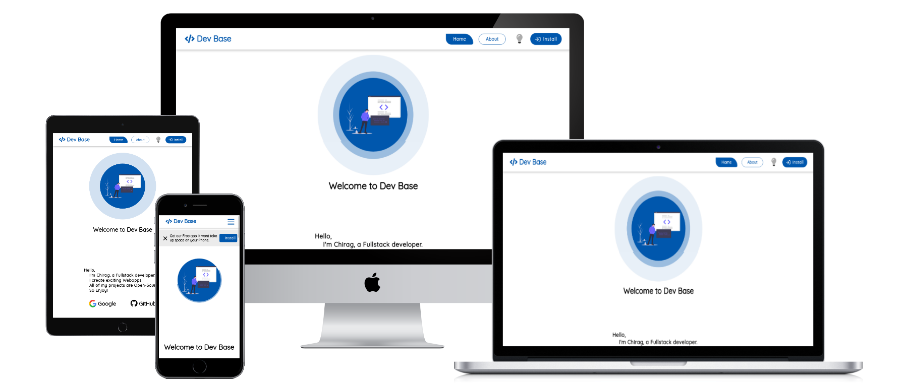

# DevBase
##### Created : 22/06/2020

 [Devbase](https://devbase.netlify.app/) is a webapp which contains all the website links developed by ChiragChrg.

### Preview

#### Languages

      
      
      
      

